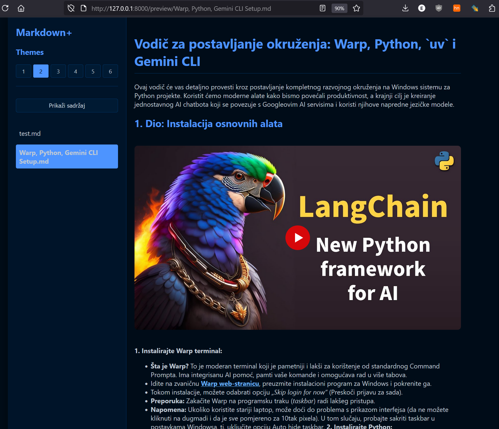

# MD+

A simple utility for processing markdown files with advanced features.

## Core Functionality
- Markdown file previewer using FastAPI
- Web interface to view all .md files in the current directory
- Preview individual markdown files with proper formatting

## Key Features

- **Themes**: Choose from 6 dark themes, including a totally dark option. Your preference is saved automatically.
- **Theme Selector Positioning**: Theme selector positioned above file list for better accessibility
- **Current File Highlighting**: Current file is visually marked in the sidebar for better navigation
- **YouTube Player Integration**: Automatically embeds YouTube videos from links in your markdown files (supports both youtube.com and youtu.be).
- **YouTube Video Thumbnails**: YouTube videos display with play button overlay for better user experience
- **Table of Contents**: Generates a clickable table of contents from your markdown headers (H1-H3) for easy navigation.
- **Automatic Header ID Generation**: Headers automatically get ID attributes for anchor links
- **Local Image Support**: Properly displays images from the local `files/images` directory.
- **Syntax Highlighting**: Code blocks are automatically colorized with language-specific highlighting.
- **Custom Font Support**: Uses a custom font from the static folder for better typography.
- **Copy Buttons**: Each code block has a convenient copy button in the top-right corner.
- **Responsive Design**: Images and code blocks automatically adjust to fit the content area.
- **Error Handling**: Graceful error handling for missing files

## Screenshot



## Getting Started

### Prerequisites

- Python 3.7 or higher
- Required Python packages (see `requirements.txt`)

### Installation

1. Clone or download this repository
2. Install the required dependencies:
   ```
   pip install -r requirements.txt
   ```

### Running the Application

1. Place your markdown files in the `files` folder
2. (Optional) Place images in the `files/images` folder
3. Run the application:
   ```
   python main.py
   ```
4. The application will automatically open in your default web browser at `http://127.0.0.1:8000`

## Usage

1. Select a markdown file from the sidebar to preview it
2. Use the theme selector to change the appearance
3. Toggle the table of contents visibility with the "Prikaži sadržaj" button
4. Click on any item in the table of contents to jump to that section
5. Click the "Copy" button on any code block to copy its content to the clipboard

## File Structure
- `main.py` - Main application logic
- `templates/` - HTML templates (index.html, preview.html, error.html)
- `static/` - CSS, fonts, and other static assets
- `files/` - Directory for markdown files and images

## Routes
- `/` - Homepage with list of all .md files
- `/preview/{file_name}` - Preview page for individual markdown files

## Dependencies
- FastAPI - Backend framework
- Uvicorn - ASGI server
- markdown-it-py - Markdown to HTML conversion
- python-multipart - File upload handling
- Jinja2 - Templating engine
- pystray - System tray integration

## Development

To modify or extend the application:

1. Edit the Python files (`main.py`, etc.) for backend changes
2. Modify HTML templates in the `templates` folder for UI changes
3. Update CSS styles in the `static` folder for styling changes
4. Add custom fonts to the `static` folder (replace `font.ttf`)

## Notes

- Ensure the `files` folder exists in the same directory as the application
- Images should be placed in `files/images` to be properly displayed
- The application runs locally and does not require an internet connection for basic functionality
- Custom themes can be added by modifying `static/themes.css`
- Theme preferences are saved in localStorage
